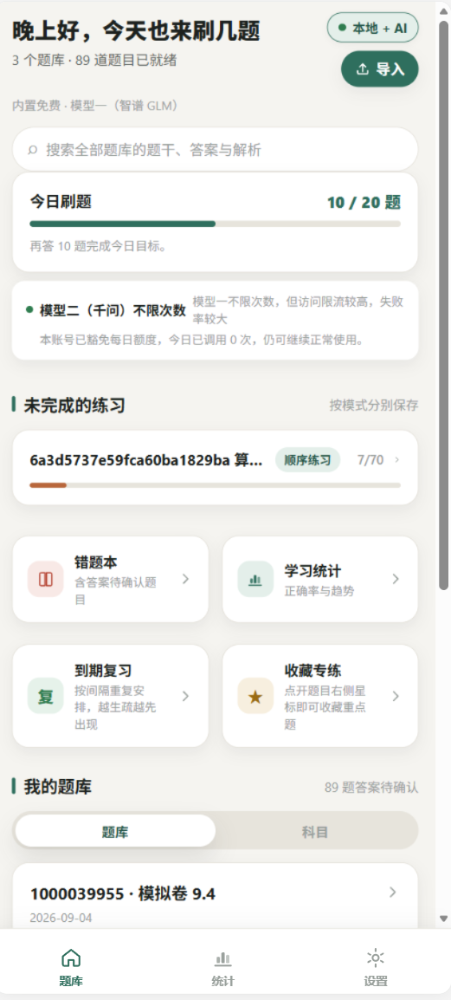
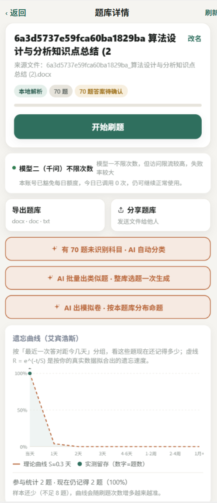
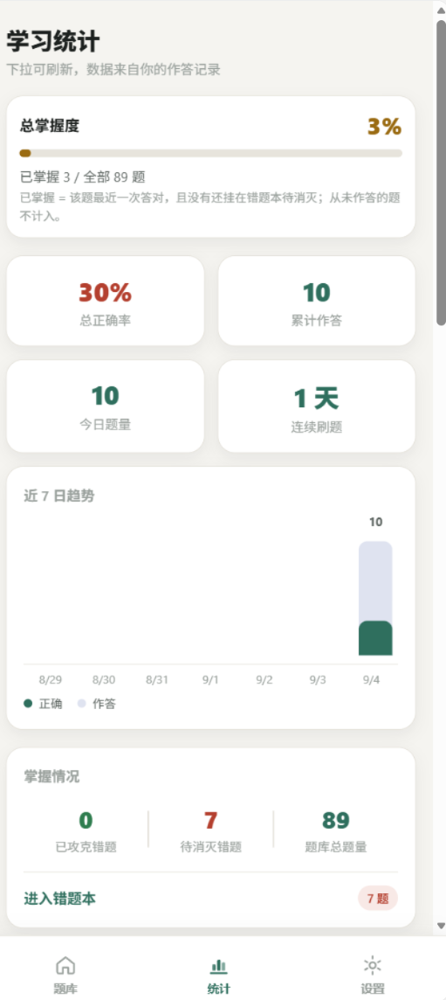
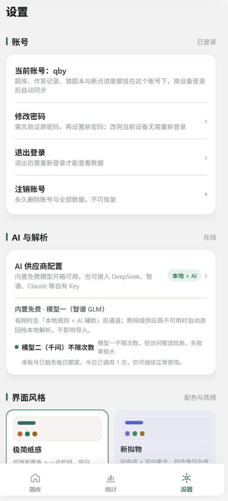
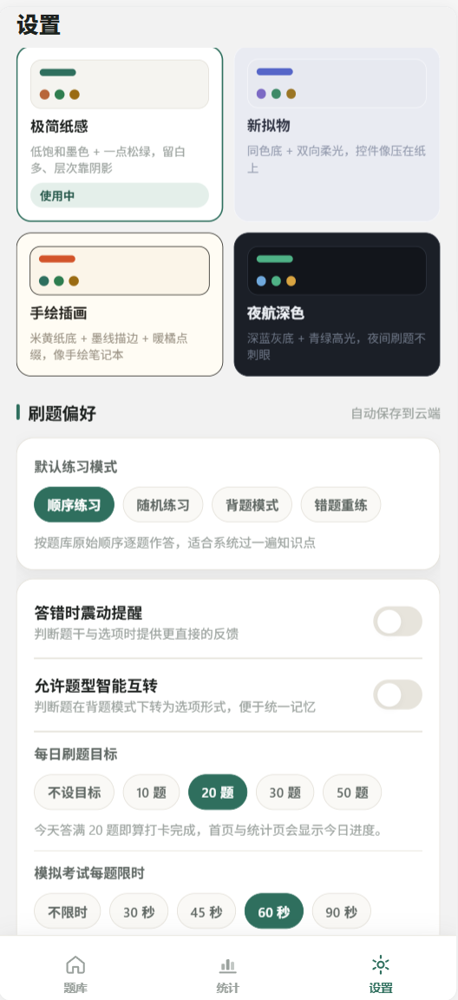
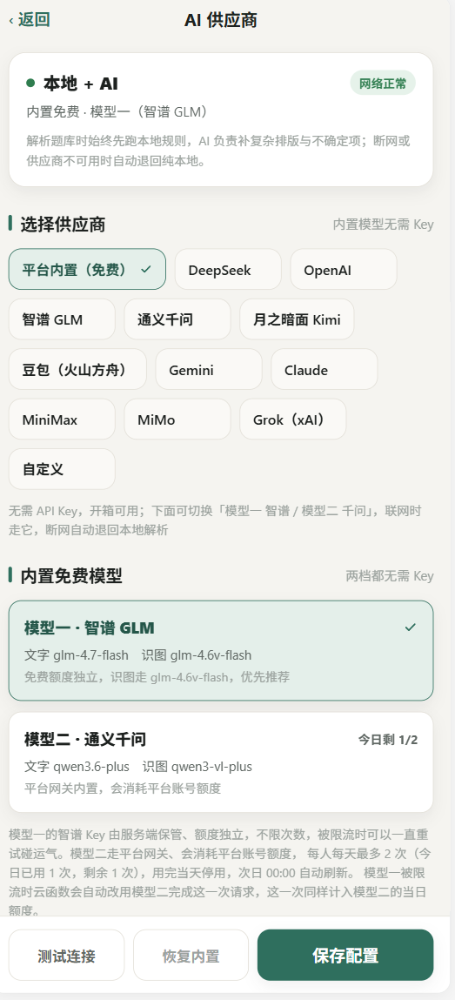

# 智能刷题系统 (Smart Quiz)

> 导入试卷 / 复习资料，自动生成题库；AI 双通道辅助解析；错题本、艾宾浩斯遗忘曲线复习、薄弱点诊断，一站式刷题工具。
>
> **License: [PolyForm Noncommercial 1.0.0](./LICENSE)** — 仅供学习交流使用，**严禁任何形式的商用** / Non-commercial use only.

## ✨ 功能特性

- **多格式导入**：支持 Word（docx/doc）、PDF、TXT 文档导入，也支持拍照 / 相册识图（图片题目 OCR）
- **双通道解析**：本地规则解析离线秒级可用；AI 辅助解析处理排版复杂、题量大的资料，断网自动回退
- **内置免费 AI**：模型一（智谱 GLM，不限次数）+ 模型二（通义千问，每日额度），也支持接入 DeepSeek、OpenAI、Claude、Gemini 等自有 Key
- **多种练习模式**：顺序练习、随机练习、背题模式、错题重练，进度按模式分别保存、续刷不丢
- **模拟考试**：每题限时（可配置 30/45/60/90 秒），时间到自动交卷
- **错题本**：按题库 / 科目汇总，连续答对两次自动移出，支持「待消灭 / 错 3 次以上 / 已攻克」分组
- **艾宾浩斯遗忘曲线**：按真实作答数据拟合记忆留存曲线，到期复习自动排程
- **AI 薄弱点诊断**：把分科目、分题型的真实表现交给 AI，生成诊断报告与练习安排
- **学习统计**：掌握度、正确率、近 7 日趋势、分科目 / 分题型 / 分题库多维度统计
- **云端同步**：题库、作答记录、错题本与断点进度按账号保存在云端（Supabase），换设备自动同步
- **数据备份**：一键导出全量 JSON 备份，可跨账号恢复；题库支持导出 docx/doc/txt 分享
- **四套界面主题**：极简纸感、新拟物、手绘插画、夜航深色

## 📱 下载 APK

前往 [**Releases**](https://github.com/QIBAOYU/smart-quiz-system/releases/latest) 页面下载最新的 Android 安装包。

## 📷 界面预览

| 首页 | 题库详情 |
| --- | --- |
|  |  |

| 学习统计 | 薄弱点诊断 |
| --- | --- |
|  |  |

| 设置 | AI 供应商 |
| --- | --- |
|  |  |

## 🛠 技术栈

- **框架**：Expo (SDK 56) + React Native 0.85 + TypeScript + expo-router 文件路由
- **后端**：Supabase（PostgreSQL + Auth + RLS 行级权限 + Edge Functions）
- **云函数**：`ai-relay`（AI 中转）/ `doc-parse`（文档与识图解析）/ `doc-export`（导出 docx）/ `account-close`（注销账号）
- **图表**：react-native-svg 自绘（趋势图、遗忘曲线、图标）

## 🚀 本地开发

```bash
pnpm install
pnpm dev          # Web 预览，端口 3015
pnpm typecheck    # TypeScript 检查
```

首次运行前复制环境变量模板并填入自己的 Supabase 项目信息：

```bash
cp .env.example .env
```

## 📂 项目结构

```
src/
  app/          # expo-router 页面（三 Tab + 栈页面）
  components/   # 通用组件（图表、编辑器、弹窗等）
  services/     # 业务服务（题库、解析、统计、备份、AI 等）
  store/        # 全局状态（App / Auth / Theme Context）
  supabase/     # Supabase 客户端与类型
functions/      # Edge Functions（云函数）
migrations/     # 数据库 migration（SQL）
```

## 📄 许可与免责声明

本项目采用 [PolyForm Noncommercial License 1.0.0](./LICENSE) 授权。

- ✅ 允许：个人学习、研究、私人娱乐、业余爱好项目等**非商业用途**的使用、修改与分享
- ❌ 禁止：任何形式的**商业用途**，包括但不限于出售、付费下载、商业培训、植入商业产品等
- 任何修改后的副本必须同样携带本许可并注明修改

> **Disclaimer / 免责声明**：本软件按「现状」提供，不附带任何明示或默示的担保。作者不对因使用本软件而产生的任何损失或纠纷承担责任。使用者请自行承担使用风险。
>
> This software is provided "as is", without warranty of any kind. It is licensed for **non-commercial use only**; any commercial use is strictly prohibited without the author's prior written permission.

---

如果这个项目对你有帮助，欢迎点个 Star ⭐
